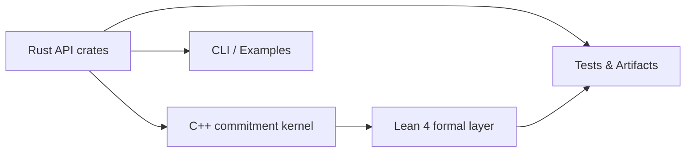

# ΛSNARK-R

[](https://github.com/SafeAGI-lab/Lambda-SNARK-R/actions/workflows/ci.yml)
[](SECURITY.md)
[](LICENSE-APACHE)

ΛSNARK-R is a research-first implementation of a post-quantum, zero-knowledge Λ-style succinct SNARK. It translates R1CS statements into reproducible proofs backed by Module-LWE commitments, pairing a Rust prover with a constant-time-oriented C++ commitment kernel. The stack integrates a Lean 4 formal verification layer so that protocol proofs and code evolve together under open review. ΛSNARK-R targets verifiable computing workloads that require transparent, auditable infrastructure while remaining an open research collaboration.

## Project Status
- **Stage:** Alpha, under active development.
- Interfaces and performance are still evolving; not production-ready.

## 🚀 Quick Start
1. Clone the workspace:
   ```bash
   git clone https://github.com/SafeAGI-lab/Lambda-SNARK-R.git
   cd Lambda-SNARK-R
   ```
2. Bootstrap dependencies (Rust toolchains, vcpkg, Lean):
   ```bash
   ./scripts/setup.sh
   ```
3. Build the Rust crates and C++ core:
   ```bash
   cargo build --manifest-path rust-api/Cargo.toml --workspace
   cmake -S cpp-core -B cpp-core/build -G Ninja
   cmake --build cpp-core/build
   ```
4. Run a CLI proof generation example:
   ```bash
   cargo run -p lambda-snark-cli --release -- healthcare \
     --input test-vectors/tv-0-linear-system/input.json
   # Produces artifacts/r1cs/healthcare.term
   ```

## 🎯 Use Cases
- Blockchain protocols that need post-quantum, succinct attestations for R1CS circuits.
- Privacy-preserving analytics pipelines (e.g., healthcare datasets) with deterministic artifacts.
- Verifiable computing backends that integrate Rust, C++, and formal proofs in one stack.
- Benchmarking and evaluating discrete Gaussian samplers under dudect timing analyses.
- Academic explorations of Module-LWE–based SNARK constructions with reproducible proofs.

## Highlights
- R1CS→ΛSNARK pipeline with dual Fiat–Shamir challenges and deterministic transcripts.
- Rust prover with audited FFI into Microsoft SEAL commitments and CLI workflows.
- C++ kernel tuned for NTT-friendly modulus 17592169062401 with precomputed roots.
- Lean 4 project (`formal/`) with completed soundness proof and active zero-knowledge work.
- Deterministic test vectors and walkthroughs that emit Lean and R1CS artifacts for review.
- Constant-time discrete Gaussian sampler plus dudect sweeps stored under `artifacts/dudect/`.
- Cross-language CI covering Rust, C++, and Lean layers through GitHub Actions.

## Architecture Overview


## Repository Layout
```
.
├── rust-api/           # Crates: lambda-snark, core, cli, sys
├── cpp-core/           # C++ NTT + commitments (SEAL)
├── formal/             # Lake + Lean 4 proofs
├── docs/               # MkDocs site and architecture notes
├── test-vectors/       # Canonical inputs/outputs
├── artifacts/          # Generated Lean/R1CS artifacts and dudect reports
└── scripts/            # Bootstrap and CI helpers
```

## Build & Test
```bash
# Rust workspace
cd rust-api
cargo build --workspace
cargo test --workspace

# C++ core
cd ../cpp-core
cmake -S . -B build -G Ninja
cmake --build build
ctest --test-dir build

# Timing sanity checks
cmake --build build --target dudect_sampler
./build/dudect_sampler  # writes artifacts/dudect/gaussian_sampler_report.md
cargo run --manifest-path ../rust-api/Cargo.toml \
  -p lambda-snark --bin mod_arith_timing  # writes artifacts/dudect/mod_arith_report.md

# Lean proofs
cd ../formal
lake build LambdaSNARK
```

## CLI Example
```bash
cargo run -p lambda-snark-cli --release -- healthcare \
  --input ../test-vectors/tv-0-linear-system/input.json
# Output: artifacts/r1cs/healthcare.term (treat as sensitive if witnesses are real)
```

See `docs/index.md` and `TESTING.md` for extended guidance and continuous integration policies.

## Current Capabilities
- Verified NTT arithmetic and modulus swap (M7.2) aligned across Rust and C++ components.
- Zero-knowledge blinding (M5.2) validated via simulator-based regression tests.
- 150+ unit, integration, and property tests spanning Rust, C++, and Lean layers.
- Healthcare walkthrough provides end-to-end proof generation with exported Lean artifacts.
- Lake-based Lean build produces the soundness theorem and supporting lemmas in `formal/`.

## Limitations
- Modular arithmetic is not yet constant-time; dudect-guided rewrites land in M7.5.
- FFI sanitizers and fuzzing harnesses are pending (target milestones M8–M9).
- Lean zero-knowledge proof scripts remain under construction for M9 delivery.
- External security audit and deployment hardening are scheduled for M10.

All limitations are tracked as roadmap items for milestones M7–M10.

## Standards
- Run `cargo fmt` and `cargo clippy --workspace --all-targets` before submitting changes.
- Execute `cargo test -p lambda-snark --no-run` to validate workspace compilation.
- For C++ updates, run `ctest --test-dir cpp-core/build`.
- For Lean updates, run `lake build LambdaSNARK`.
- Do not commit sensitive witnesses or artifacts outside `artifacts/`.

## Roadmap (excerpt)
- ✅ M5.1: O(m log m) NTT implementation.
- ✅ M5.2: Zero-knowledge blinding and simulator tests.
- ✅ M7.2: Prime modulus swap and soundness restoration.
- 🔄 M7.4: Expand to >200 tests (property, fuzz).
- 🔄 M7.5: Constant-time rewrite validated with dudect.
- ✅ M8: Lean soundness proof finalized; zero-knowledge proof continues in M9.
- 🔜 M9: Lean zero-knowledge proof scripts.
- 🔜 M10: External audit and hardening backlog.

Full milestone map lives in `ROADMAP.md`.

## Community
- Issues: GitHub tracker (non-security).
- Security disclosures: follow `SECURITY.md` (email, PGP).
- Discussions: GitHub Discussions and SafeAGI Zulip `#lambda-snark`.
- Contributing: see `CONTRIBUTING.md`; security-sensitive changes need dual review.

## License
Dual-licensed under [MIT](LICENSE-MIT) and [Apache-2.0](LICENSE-APACHE); contributions imply agreement with both.

---

Last updated: 2025-11-28
