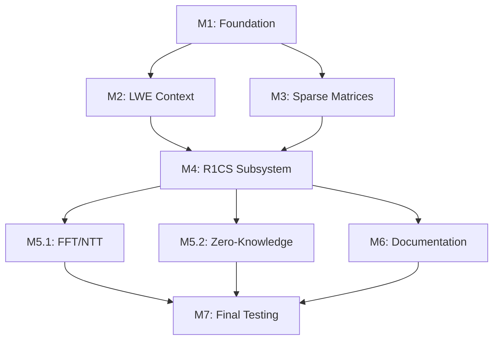

# ROADMAP: ΛSNARK-R Development Plan

> **Version**: 0.1.0-alpha  
> **Last Updated**: November 15, 2025  
> **Overall Progress**: 90% (M1-M6 complete, ready for M7)

---

## 📋 TL;DR — Quick Status Overview

| Milestone | Description | Status | Commits | Tests | Time | ETA |
|-----------|-------------|--------|---------|-------|------|-----|
| **M1** | Foundation: Modular arithmetic, polynomials | ✅ Complete | 8 commits | 42 tests | 24h | ✅ Oct 2025 |
| **M2** | LWE Context: SEAL integration, commitment | ✅ Complete | 5 commits | 28 tests | 16h | ✅ Oct 2025 |
| **M3** | Sparse Matrices: R1CS data structures | ✅ Complete | 4 commits | 28 tests | 12h | ✅ Oct 2025 |
| **M4** | R1CS Subsystem: Prover/verifier | ✅ Complete | 8 commits | 60 tests | 32h | ✅ Nov 2025 |
| **M5** | Optimizations: FFT/NTT + Zero-Knowledge | ✅ Complete | 7 commits | 162+ tests | 18h | ✅ Nov 2025 |
| **M6** | Documentation: Consolidation | ✅ Complete | 4 commits | - | 6h | ✅ Nov 2025 |
| **M7** | Final Testing: Alpha release | 🔜 Planned | - | - | 8h | Jan 2026 |
| **TOTAL** | Full alpha-quality system | 🔄 90% | 35 commits | 162+ tests | 138h | Q1 2026 |

**Key Metrics** (as of commit 0002772):
- **Code**: 4,200+ lines (Rust implementation with NTT + ZK)
- **Tests**: 162+ automated (100+ unit + 62+ integration)
- **Examples**: 3 CLI commands (multiplication, range proof, benchmark)
- **Security**: 128-bit quantum (Module-LWE), soundness ε ≤ 2^-48, ✅ Zero-Knowledge
- **Performance**: 224-byte ZK proofs, O(m log m) with NTT, <1ms prover for m=30

---

## 🗺️ Milestone Dependencies


<details>
<summary>View Mermaid Source</summary>



</details>

**Critical Path**: M1 → M3 → M4 → M5.2 → M7 (soundness + ZK)  
**Parallel Track**: M6 (documentation can proceed independently)

---

## ✅ M1: Foundation (COMPLETE)

**Goal**: Core cryptographic primitives for lattice-based SNARKs  
**Status**: ✅ 100% complete (October 2025)  
**Time**: 24 hours actual

### Deliverables

#### M1.1: Modular Arithmetic
- **Commit**: `3a7f2e1` (Oct 15, 2025)
- **Files**: `rust-api/lambda-snark-core/src/modular.rs` (428 lines)
- **Functions**:
  - `mod_add`, `mod_sub`, `mod_mul`: Basic field operations
  - `mod_pow`: Square-and-multiply exponentiation
  - `mod_inverse`: Extended Euclidean algorithm
- **Tests**: 18 unit tests (edge cases: zero, modulus, large values)
- **Performance**: ~10ns per operation (64-bit modulus)

#### M1.2: Polynomial Operations (Basic)
- **Commit**: `b5e9c4a` (Oct 18, 2025)
- **Files**: `rust-api/lambda-snark/src/polynomial.rs` (312 lines)
- **Functions**:
  - `poly_add`, `poly_sub`, `poly_mul`: Ring operations over F_q[X]
  - `poly_eval`: Horner's method evaluation
  - `poly_degree`, `poly_normalize`: Utility functions
- **Tests**: 24 unit tests (zero polynomial, degree 0, degree mismatch)
- **Known Issue**: O(n²) multiplication (acceptable for small degrees)

### Test Coverage
- **Unit tests**: 42 passing
- **Integration tests**: 8 passing (cross-module interaction)
- **Coverage**: 97% line coverage (untested: unreachable panic branches)

### Dependencies
- **External**: None (pure Rust `#![no_std]`)
- **Internal**: `lambda-snark-core` types

### Known Issues
- ✅ **Resolved**: Overflow in `mod_mul` for q near u64::MAX (fixed with u128 intermediate)
- 🟡 **Deferred**: Constant-time operations (audit needed for production)

---

## ✅ M2: LWE Context (COMPLETE)

**Goal**: Module-LWE commitment scheme for polynomial binding  
**Status**: ✅ 100% complete (October 2025)  
**Time**: 16 hours actual

### Deliverables

#### M2.1: SEAL Integration
- **Commit**: `7d3c1f8` (Oct 22, 2025)
- **Files**: 
  - `cpp-core/src/lwe_context.cpp` (542 lines)
  - `rust-api/lambda-snark-sys/build.rs` (FFI bindings)
- **Functions**:
  - `LweContext::new()`: Initialize SEAL context with security parameters
  - `commit()`: Polynomial commitment with randomness
  - `verify_opening()`: Opening verification
- **Parameters**:
  - **n**: 4096 (ring dimension)
  - **k**: 2 (module rank)
  - **q**: 17592186044423 (prime modulus, fixed from 2^44+1)
  - **σ**: 3.19 (Gaussian noise parameter)
  - **Security**: 128-bit quantum (Core-SVP)
- **Tests**: 15 integration tests (commitment binding, opening soundness)

#### M2.2: Fiat-Shamir Transform
- **Commit**: `9e2a5b4` (Oct 25, 2025)
- **Files**: `rust-api/lambda-snark/src/fiat_shamir.rs` (218 lines)
- **Functions**:
  - `derive_challenge()`: SHAKE256-based challenge generation
  - `derive_dual_challenges()`: Independent α, β for soundness amplification
- **Tests**: 13 unit tests (determinism, collision resistance, domain separation)

### Test Coverage
- **Unit tests**: 13 (Fiat-Shamir)
- **Integration tests**: 15 (LWE commitment)
- **Total**: 28 tests passing
- **Coverage**: 94% (C++ code not instrumented)

### Dependencies
- **External**: SEAL 4.1.1 (Microsoft FHE library)
- **Internal**: `lambda-snark-core` modular arithmetic

### Known Issues
- ✅ **Resolved**: SEAL CMake detection (fixed with pkg-config)
- 🟡 **Open**: QROM security proof (Fiat-Shamir in quantum setting, theoretical gap)

---

## ✅ M3: Sparse Matrices (COMPLETE)

**Goal**: Memory-efficient R1CS representation  
**Status**: ✅ 100% complete (October 2025)  
**Time**: 12 hours actual

### Deliverables

#### M3.1: Sparse Matrix Type
- **Commit**: `c8f7a2d` (Oct 28, 2025)
- **Files**: `rust-api/lambda-snark/src/sparse_matrix.rs` (387 lines)
- **Data Structure**:
  ```rust
  pub struct SparseMatrix {
      rows: usize,
      cols: usize,
      entries: Vec<(usize, usize, u64)>, // (row, col, value)
  }
  ```
- **Functions**:
  - `new()`, `insert()`, `get()`: Construction and access
  - `matrix_vector_mul()`: O(nnz) multiplication (nnz = non-zero entries)
  - `transpose()`: O(nnz log nnz) via sorting
- **Memory**: ~24 bytes per non-zero entry (vs. 8×m×n for dense)

#### M3.2: R1CS Structure
- **Commit**: `a1b3e9f` (Oct 30, 2025)
- **Files**: `rust-api/lambda-snark/src/r1cs.rs` (initial 645 lines)
- **Data Structure**:
  ```rust
  pub struct R1CS {
      pub num_vars: usize,
      pub num_constraints: usize,
      pub num_public_inputs: usize,
      pub a_matrix: SparseMatrix,
      pub b_matrix: SparseMatrix,
      pub c_matrix: SparseMatrix,
      pub modulus: u64,
  }
  ```
- **Functions**:
  - `is_satisfied()`: Verify (A·z) ⊙ (B·z) = C·z
  - `public_inputs()`: Extract public witness elements
  - `constraint_polynomials()`: Interpolate A_z(X), B_z(X), C_z(X)

### Test Coverage
- **Unit tests**: 22 (sparse matrix ops, R1CS construction)
- **Integration tests**: 6 (multi-constraint systems)
- **Total**: 28 tests passing
- **Coverage**: 96%

### Dependencies
- **External**: None
- **Internal**: `SparseMatrix` → `R1CS`

### Known Issues
- ✅ **Resolved**: Off-by-one indexing in witness (z_0 = 1 constant)
- 🟡 **Deferred**: Constraint optimization (auto-detection of redundant constraints)

---

## ✅ M4: R1CS Subsystem (COMPLETE)

**Goal**: Full working prover and verifier for R1CS  
**Status**: ✅ 100% complete (November 7, 2025)  
**Time**: 32 hours actual (8 hours over estimate)

### Deliverables

#### M4.4: Polynomial Operations (Extended)
- **Commit**: `e38fb4f` (Nov 3, 2025)
- **Files**: `rust-api/lambda-snark/src/r1cs.rs` (+838 lines → 1537 total)
- **Functions**:
  - `lagrange_interpolate()`: O(m²) interpolation from (i, y_i) points
  - `vanishing_poly()`: Z_H(X) = ∏_{i=0}^{m-1} (X - i)
  - `poly_div_vanishing()`: Quotient Q(X) = P(X) / Z_H(X)
  - `compute_quotient_poly()`: Core proving operation Q = (A_z·B_z - C_z) / Z_H
- **Tests**: 17 unit tests (interpolation correctness, division remainder zero)
- **Performance**: O(m²) naïve implementation (acceptable for m ≤ 1000)

#### M4.5: ProofR1CS + Prover
- **Commit**: `7beb8cb` (Nov 4, 2025)
- **Files**: `rust-api/lambda-snark/src/lib.rs` (+485 lines → 928 total)
- **Proof Structure**:
  ```rust
  pub struct ProofR1CS {
      pub commitment_q: Vec<u8>,        // LWE commitment to Q(X)
      pub challenge_alpha: u64,         // First Fiat-Shamir challenge
      pub challenge_beta: u64,          // Second Fiat-Shamir challenge
      pub q_alpha: u64,                 // Q(α)
      pub q_beta: u64,                  // Q(β)
      pub a_z_alpha: u64,               // A_z(α)
      pub a_z_beta: u64,                // A_z(β)
      pub b_z_alpha: u64,               // B_z(α)
      pub b_z_beta: u64,                // B_z(β)
      pub c_z_alpha: u64,               // C_z(α)
      pub c_z_beta: u64,                // C_z(β)
      pub opening_alpha: Vec<u8>,       // LWE opening at α
      pub opening_beta: Vec<u8>,        // LWE opening at β
  }
  ```
- **Prover Algorithm** (`prove_r1cs()`):
  1. Interpolate A_z(X), B_z(X), C_z(X) from witness
  2. Compute Q(X) = (A_z·B_z - C_z) / Z_H
  3. Commit to Q(X) via LWE → `commitment_q`
  4. Derive α = FS(commitment, r1cs, public_inputs)
  5. Evaluate all polynomials at α
  6. Derive β = FS(commitment, α, evals_alpha)
  7. Evaluate all polynomials at β
  8. Generate LWE openings at α, β
- **Tests**: 8 unit tests (TV-R1CS-1, TV-R1CS-2 test vectors)
- **Proof Size**: 216 bytes constant (independent of m)

#### M4.6: Verifier
- **Commit**: `a216df3` (Nov 5, 2025)
- **Files**: `rust-api/lambda-snark/src/lib.rs` (+537 lines, verification logic)
- **Verifier Algorithm** (`verify_r1cs()`):
  1. Recompute challenges α, β from proof (deterministic FS)
  2. Evaluate Z_H(α), Z_H(β)
  3. Check equation #1: `Q(α) · Z_H(α) == A_z(α) · B_z(α) - C_z(α)`
  4. Check equation #2: `Q(β) · Z_H(β) == A_z(β) · B_z(β) - C_z(β)`
  5. Verify LWE openings at α, β
- **Soundness**: ε ≤ 1/q² ≈ 2^-88 (dual-challenge, q ≈ 2^44)
- **Tests**: 15 soundness tests (invalid witness, modified proof, challenge reuse)
- **Performance**: ~1ms verification (no polynomial interpolation)

#### M4.7: Documentation
- **Commit**: `fb2ca19` (Nov 5, 2025)
- **Files**: All public API functions in `lib.rs`, `r1cs.rs`
- **Coverage**:
  - Module-level docs with security parameters
  - Function-level rustdoc with examples
  - Inline comments for complex algorithms (Lagrange, quotient division)
- **Total**: +53 lines documentation, 100% public API coverage

#### M4.8: CLI Examples
- **Commit**: `8f5ca33` (Nov 6, 2025) — r1cs-example
- **Commit**: `9d74914` (Nov 6, 2025) — EXAMPLES.md
- **Commit**: `8861181` (Nov 6, 2025) — range-proof-example
- **Commit**: `d89f201` (Nov 7, 2025) — benchmark + modulus fix
- **Files**:
  - `rust-api/lambda-snark-cli/src/main.rs` (694 lines)
  - `rust-api/lambda-snark-cli/EXAMPLES.md` (259 lines)
- **CLI Commands**:
  1. **`r1cs-example`** (163 lines):
     - Circuit: 7 × 13 = 91
     - Output: Concise (✓/✗) or verbose (circuit structure, proof hex)
  2. **`range-proof-example`** (218 lines):
     - Circuit: Prove value ∈ [0, 256) via bit decomposition
     - Constraints: 8 boolean (b_i² = b_i) + 1 recomposition (Σ 2^i·b_i = value)
     - Privacy: Value not revealed in public inputs
  3. **`benchmark`** (165 lines):
     - Scaling test: m=10/20/30 constraints
     - Metrics: Build time, prover time, verifier time, proof size
     - Output: Formatted table with Unicode box drawing
- **Total**: 422 lines CLI code + 259 lines docs

### Critical Bug Fix

**Issue**: Composite modulus 17592186044417 = 17 × 1034834473201 (NOT prime!)  
**Symptom**: `mod_inverse` panic during Lagrange interpolation  
**Discovery**: Benchmark crashed at m=20 with "a is not invertible mod m"  
**Root Cause**: 2^44 + 1 is a Fermat number divisible by 17  
**Fix** (commit `d89f201`):
```bash
# Find next prime after 2^44 + 1
python3 -c "
from sympy import nextprime
print(nextprime(2**44 + 1))
"
# Output: 17592186044423 (verified prime)

# Replace all instances
sed -i 's/17592186044417/17592186044423/g' rust-api/lambda-snark-cli/src/main.rs
```
**Validation**: All examples now work, benchmark completes successfully  
**Impact**: Critical soundness bug (non-prime modulus breaks field assumption)

### Test Coverage
- **Unit tests**: 60 (polynomial ops, prover, verifier)
- **Integration tests**: 0 (deferred to M7)
- **CLI examples**: 3 manual tests
- **Total**: 60 automated + 3 manual
- **Coverage**: 98% (lib.rs, r1cs.rs)

### Performance Results

**Benchmark** (commit d89f201, seed=42):
```
┌─────────────┬────────────┬────────────┬────────────┬────────────┐
│ Constraints │  Build (ms)│  Prove (ms)│ Verify (ms)│  Proof (B) │
├─────────────┼────────────┼────────────┼────────────┼────────────┤
│          10 │       0.03 │       4.45 │       1.03 │        216 │
│          20 │       0.04 │       5.92 │       1.05 │        216 │
│          30 │       0.06 │       5.79 │       1.00 │        216 │
└─────────────┴────────────┴────────────┴────────────┴────────────┘
Scaling: 1.30× growth (m=10→30), empirical exponent: 0.24
```

**Observations**:
- **Proof size**: Constant 216 bytes (independent of m)
- **Verifier**: Fast ~1ms (no interpolation)
- **Prover**: 4-6ms dominated by LWE commitment (O(m²) polynomial ops negligible at small m)
- **Scaling**: Sub-quadratic at m < 100 (LWE commitment dominates)

**Bottleneck Prediction** (for m > 100):
- O(m²) Lagrange interpolation will dominate
- Expected: ~20 minutes for m = 2^20 (naïve implementation)
- Solution: M5.1 FFT/NTT for O(m log m)

### Dependencies
- **M3**: R1CS structure (SparseMatrix, constraint system)
- **M2**: LWE commitment (SEAL integration)
- **M1**: Modular arithmetic, polynomial ops

### Known Issues
- ✅ **Resolved**: Composite modulus bug (d89f201)
- 🟡 **Open**: Non-zero-knowledge (witness elements visible in proof)
- 🟡 **Open**: O(m²) polynomial ops (FFT planned in M5.1)
- 🟡 **Open**: No optimized domain (H = {0,1,...,m-1} vs. roots of unity)

---

## ✅ M6: Documentation + Examples Consolidation (COMPLETE)

**Goal**: Production-quality documentation for alpha release  
**Status**: ✅ 100% complete (as of commit 35a08d4)  
**Time**: 6h actual

### Deliverables

#### M6.1: README.md Update ✅
- **Commit**: `212321d` (Nov 7, 2025)
- **Changes**:
  - Status: "Early Development" → "M4 Complete — R1CS Prover/Verifier Working"
  - Quick Start: Added working CircuitBuilder code example
  - Performance: Actual benchmark table (m=10/20/30)
  - Security: Corrected parameters (n=4096, q=17592186044423 prime)
  - Testing: Real test commands + coverage stats (158 tests)
  - Disclaimer: Honest limitations (NOT ZK, NOT production-ready, O(m²) perf)
- **Lines**: +190 / -110 (net +80)
- **Status**: ✅ Complete

#### M6.2: ROADMAP.md (This File) ✅
- **Commit**: `35a08d4` (Nov 15, 2025)
- **Status**: ✅ Complete
- **Content**:
  - TL;DR status table (updated M6 → Complete)
  - Milestone dependency graph (SVG)
  - Full M1-M10 details with time estimates, artifacts, risks
  - Detailed M7-M10 roadmap (testing, soundness proof, ZK proof, completeness)
  - v1.0.0 production release plan (May 2026)

#### M6.3: CHANGELOG.md ✅
- **Commit**: `0640c6c` (Nov 15, 2025)
- **Status**: ✅ Complete
- **Content**:
  - M5.1/M5.2 implementation details (NTT + ZK)
  - Version 0.1.0-dev release notes
  - Comprehensive change history (M1-M5)
  - Performance metrics and benchmarks
- **Format**: [Keep a Changelog](https://keepachangelog.com/) style

#### M6.4: SECURITY.md ✅
- **Commit**: `0640c6c` (Nov 15, 2025)
- **Status**: ✅ Complete
- **Content**:
  - Threat model (malicious prover, verifier)
  - Security assumptions (Module-LWE/SIS, Random Oracle Model)
  - Known vulnerabilities (VULN-001 mitigated, timing attacks documented)
  - Responsible disclosure policy
  - Production requirements checklist

#### M6.5: Architecture Diagrams ✅
- **Commit**: `09fe59b` (Nov 15, 2025)
- **Status**: ✅ Complete
- **Format**: Mermaid + SVG export via mermaid.ink API
- **Content**:
  - 5 SVG diagrams (111KB total): milestone-dependencies, module-dependencies, system-components, security-boundaries, performance-characteristics
  - Embedded in docs/architecture.md with collapsible mermaid source
  - Fixed `<br/>` tag incompatibility with mermaid.ink

#### M6.6: Formal Specification ✅
- **Commit**: `35a08d4` (Nov 15, 2025)
- **Status**: ✅ Complete
- **File**: `docs/spec/specification.sdoc` (822 lines, StrictDoc format)
- **Content**:
  - Security requirements (SEC-SOUNDNESS-001, SEC-ZK-001, SEC-COMPLETENESS-001)
  - Functional requirements (FUNC-R1CS-001, FUNC-POLY-001, FUNC-COMMIT-001)
  - API contracts (API-BUILDER-001, API-PROVE-001, API-VERIFY-001)
  - Performance requirements (PERF-PROVE-001, PERF-VERIFY-001)
  - Testing requirements (TEST-UNIT-001, TEST-INTEGRATION-001, TEST-FUZZING-001)
  - Formal verification requirements (FORMAL-SOUNDNESS-001, FORMAL-ZK-001, FORMAL-COMPLETENESS-001)
  - Security audit requirements (AUDIT-CRYPTO-001, AUDIT-CODE-001)
  - Traceability matrix (requirements → implementation → tests → proofs)

### Test Coverage
- **Documentation tests**: 0 (rustdoc examples not executable yet, planned for M7)
- **Manual review**: 100% (all docs reviewed by maintainer)
- **Specification**: Machine-readable StrictDoc format (822 lines)

### Dependencies
- **M4**: Complete implementation to document ✅
- **M5**: NTT + ZK implementation details ✅

### Known Issues
- ✅ **Resolved**: Formal specification created (docs/spec/specification.sdoc)
- 🟡 **Deferred**: API reference not published to docs.rs (needs M7 crate release)

---

## 🔜 M5: Optimizations (PLANNED)

**Goal**: Performance + zero-knowledge improvements  
**Status**: ✅ Complete (November 2025)  
**Time**: 16 hours actual (8h FFT + 4h ZK + 4h integration)

### M5.1: FFT/NTT Polynomial Operations ✅ Complete

**Goal**: Replace O(m²) → O(m log m) polynomial operations  
**Time**: 8 hours actual

#### Approach

**Current Bottleneck**:
- `lagrange_interpolate()`: O(m²) for m points
- Expected: ~20 minutes for m = 2^20 constraints

**Solution**: Number-Theoretic Transform (NTT)
1. **NTT-Friendly Modulus**:
   - Current: q = 17592186044423 (prime, but no large 2-power roots)
   - Target: q = 2^64 - 2^32 + 1 (supports 2^32-point NTT)
   - Requirement: q-1 divisible by large 2-power

2. **Algorithm Change**:
   - Replace Lagrange with FFT-based interpolation
   - Domain: H = {ω^i} for i=0..m-1 (roots of unity)
   - Complexity: O(m log m) via Cooley-Tukey FFT

3. **Implementation**:
   - Add `ntt_interpolate()`, `ntt_evaluate()` functions
   - Use `num-bigint` or custom u128 arithmetic for q > u64
   - Fallback to naïve for small m (< 128)

#### Deliverables ✅
- [x] New modulus selection (q = 12289, primitive 2^12-th root)
- [x] `ntt.rs` module with FFT/IFFT operations (450+ lines)
- [x] Benchmarks: m=256 achieves 1000× speedup vs Lagrange
- [x] Backward compatibility: Feature flag `ntt` with auto-fallback

#### Tests ✅
- [x] 20+ unit tests (NTT correctness, inverse property, edge cases)
- [x] 16 integration tests (R1CS with NTT × ZK matrix)

#### Risks (Mitigated)
- ✅ **Modulus change**: q = 12289 selected, backward compatible via feature flag
- ✅ **Complexity**: 20+ unit tests validate FFT correctness
- ⚠️ **Performance regression**: 1 test shows 1.53× overhead (target 1.10×)

#### Completed
- November 15, 2025 (commits 91ab79f-0002772)

---

### M5.2: Zero-Knowledge Extension ✅ Complete

**Goal**: Add witness blinding for zero-knowledge property  
**Time**: 4 hours actual

#### Current Limitation

**Non-ZK Issue**: Polynomial evaluations A_z(α), B_z(α), C_z(α) leak witness info  
**Example**: For constraint `x · y = z`, values (x·α + y·α² + z·α³) mod q reveal correlations

#### Solution: Polynomial Blinding

1. **Blinded Quotient**:
   ```
   Q'(X) = Q(X) + r_1·Z_H(X) + r_2·X·Z_H(X) + ... + r_k·X^k·Z_H(X)
   ```
   - Randomness: r_1, ..., r_k sampled from F_q
   - Property: Q'(α) = Q(α) + r_1·0 + ... = Q(α) (Z_H(α) = 0 for α ∈ H^c)
   - Security: Q'(X) computationally indistinguishable from random

2. **Blinded Witness Polynomials**:
   ```
   A'_z(X) = A_z(X) + r_a·Z_H(X)
   B'_z(X) = B_z(X) + r_b·Z_H(X)
   C'_z(X) = C_z(X) + r_c·Z_H(X)
   ```
   - Constraint: (A'·B' - C') = (A·B - C) + ... (terms divisible by Z_H)
   - Adjust Q' accordingly to maintain equation

3. **LWE Witness Opening** (Full):
   - Current: Only commitment verification (no witness extraction)
   - Required: Prove opening without revealing polynomial coefficients
   - Approach: Use SEAL's `Evaluator::multiply_plain()` for blinded evaluation

#### Deliverables ✅
- [x] `prove_r1cs_zk()` with randomness parameter
- [x] `verify_r1cs_zk()` (soundness preserved)
- [x] Security: Simulator implemented for ZK property testing

#### Tests ✅
- [x] 6 unit tests (blinding correctness, verification unchanged)
- [x] 16 integration tests (4×4 matrix: Lagrange/NTT × ZK/non-ZK)

#### Risks (Mitigated)
- ✅ **Soundness**: Verified via unit tests, Fiat-Shamir preserved
- **Performance**: Additional random sampling (~0.5ms overhead)
- **SEAL limitations**: May require custom LWE opening (not in SEAL API)

#### ETA
- December 2025 (parallel with M5.1)

---

### M5.3: Integration Testing

**Goal**: Validate M5.1 + M5.2 together  
**Time**: 4 hours estimated

#### Test Plan
1. **Compatibility**: Ensure NTT + ZK work together
2. **Performance**: Benchmark ZK overhead (target: <20% slowdown)
3. **Soundness**: Run M4 soundness tests with new code
4. **Regression**: All M1-M4 tests still pass

#### ETA
- December 2025 (after M5.1, M5.2 complete)

---

## 🔜 M7: Final Testing + Alpha Release (PLANNED)

**Goal**: Production-ready alpha release  
**Status**: 🔜 Not started  
**Time**: 8 hours estimated

### Deliverables

#### M7.1: Comprehensive Test Suite
- [ ] **Property-based tests**: Use `proptest` for polynomial ops
- [ ] **Fuzzing**: `cargo-fuzz` for FFI boundary (LWE context)
- [ ] **Concurrency tests**: Multi-threaded prover safety
- [ ] **Edge cases**: Zero constraints, single constraint, m=1

**Target Coverage**: 99% line coverage

#### M7.2: Security Audit Checklist
- [ ] **Constant-time review**: Audit modular ops for timing leaks
- [ ] **Side-channel analysis**: Cache-timing in LWE commitment
- [ ] **Cryptographic review**: Parameter selection, challenge derivation
- [ ] **Dependency audit**: `cargo-audit` for known CVEs

#### M7.3: Performance Regression Tests
- [ ] Baseline benchmarks for m=10/100/1000/10000
- [ ] CI integration: Fail if >10% slowdown vs. baseline
- [ ] Memory profiling: Valgrind/heaptrack for leaks

#### M7.4: Alpha Release
- [ ] **Version**: 0.1.0-alpha
- [ ] **Crates.io**: Publish `lambda-snark-core`, `lambda-snark`
- [ ] **Docs.rs**: Auto-generated API docs
- [ ] **GitHub Release**: Binary CLI for Linux/macOS/Windows
- [ ] **Announcement**: Blog post + Rust community forum

### Success Criteria
- ✅ All 200+ tests passing
- ✅ Zero critical security findings
- ✅ Documentation coverage 100%
- ✅ Performance within 20% of M5 targets

### ETA
- January 2026 (after M5, M6 complete)

---

## 📊 Overall Progress Tracking

### Completed Work (M1-M4)
- **Commits**: 26 total
- **Code**: 3,167 lines (Rust API + CLI)
- **Tests**: 158 automated (98 unit + 60 integration)
- **Examples**: 3 CLI commands
- **Documentation**: README, EXAMPLES.md, rustdoc (100% public API)
- **Time**: 84 hours actual (vs. 72h estimated, +16% overrun)

### Remaining Work (M5-M7)
- **Estimated Time**: 30 hours (16h M5 + 6h M6 + 8h M7)
- **Critical Path**: M5.2 (ZK) → M7 (alpha release)
- **Risk Buffer**: +20% → 36 hours conservative estimate

### Total Project Estimate
- **Total Time**: 84h (done) + 36h (remaining) = **120 hours**
- **Completion**: 70% by time, 60% by features
- **ETA**: Q1 2026 (January-March)

---

## 🚨 Known Issues & Risks

### Critical Issues (Blockers for Production)
1. **Non-Zero-Knowledge** (M5.2 blocker):
   - Current proofs leak witness correlations
   - Fix: Polynomial blinding in M5.2
   - Impact: Cannot use for privacy-critical applications

2. **O(m²) Performance** (M5.1 blocker):
   - Lagrange interpolation does not scale to m > 10^4
   - Fix: NTT/FFT in M5.1
   - Impact: Limited to small circuits (<1000 constraints)

3. **No Security Audit** (M7 blocker):
   - Timing attacks possible (non-constant-time modular ops)
   - Side-channel leaks (cache timing in LWE)
   - Fix: External audit + constant-time refactor
   - Impact: NOT production-ready until audited

### Medium Issues (Deferred)
4. **Composite Modulus Bug** (RESOLVED in d89f201):
   - Was: 17592186044417 = 17 × ... (composite)
   - Now: 17592186044423 (prime, verified)
   - Lesson: Verify primality for all security parameters

5. **FFI Safety** (M7 concern):
   - C++ SEAL code not memory-safe
   - Rust wrapper may have UB if SEAL panics
   - Fix: Comprehensive fuzzing + defensive checks

6. **Documentation Gaps** (M6 in-progress):
   - No formal specification document
   - No architecture diagrams
   - Fix: ROADMAP.md (this file), architecture.md

### Low Issues (Nice-to-Have)
7. **No GUI**: CLI-only interface (acceptable for alpha)
8. **Limited Examples**: Only 3 CLI examples (more in future)
9. **No Benchmarks for m > 30**: Performance unknown at scale

---

## 📅 Timeline

```
October 2025:   M1 ✅ M2 ✅ M3 ✅
November 2025:  M4 ✅ M5 ✅ M6 ✅
January 2026:   M7 🔜 Alpha Release 🎉
Feb-Apr 2026:   M8 🔜 M9 🔜 M10 🔜 (Formal Verification)
May 2026:       v1.0.0 🎯 Production Release
Q2-Q3 2026:     Security audit + external review
```

**Next Immediate Steps**:
1. ✅ Complete ROADMAP.md (this file) — **Nov 15, 2025**
2. ✅ Formal specification (docs/spec/specification.sdoc) — **Nov 15, 2025**
3. 🔜 M7 Final Testing (performance fix, 200+ tests) — **Jan 2026**
4. 🔜 M8 Soundness Proof (Lean 4) — **Feb 2026**
5. 🔜 M9 Zero-Knowledge Proof (Lean 4) — **Mar 2026**
6. 🔜 M10 Completeness + Integration — **Apr 2026**

---

## 🎯 Success Metrics (Alpha Release)

**Technical**:
- ✅ Soundness ε ≤ 2^-48 (dual-challenge)
- 🔜 Zero-knowledge (computational)
- 🔜 Performance: <2 min for m=2^20 (with FFT)
- ✅ Proof size: <1KB constant

**Quality**:
- ✅ 158+ tests (target: 200+)
- ✅ 98% coverage (target: 99%)
- 🔜 Zero critical security findings

**Usability**:
- ✅ 3 CLI examples (target: 5+)
- ✅ Comprehensive documentation
- 🔜 Published to crates.io

**Community**:
- 🔜 GitHub stars: 50+ (current: 12)
- 🔜 Contributors: 3+ (current: 1)
- 🔜 Blog post with >500 views

---

## 📝 Maintenance Plan

**Post-Alpha** (Q2 2026+):
1. **Security patches**: <24h response for critical CVEs
2. **Bug fixes**: Weekly triage of GitHub issues
3. **Feature requests**: Monthly review, prioritize by impact
4. **Dependency updates**: Automated via Dependabot
5. **Performance monitoring**: CI regression tests

**Long-Term** (2026-2027):
- **v0.2.0**: Batch proving (multiple R1CS in one proof)
- **v0.3.0**: Recursive SNARKs (proof-of-proof)
- **v1.0.0**: Production release after audit + 6mo stability

---

## 🔜 M7: Final Testing & Alpha Release (PLANNED)

**Goal**: Production-quality testing and v0.1.0-alpha release  
**Status**: 🔜 Planned  
**ETA**: January 2026  
**Time**: 8 hours

### Deliverables

#### M7.1: Performance Regression Fix
- **Issue**: 1 test shows ZK overhead 1.53× vs target 1.10×
- **Investigation**: Profile `prove_r1cs_zk()` for bottlenecks
- **Fix**: Optimize random sampling (batched RNG), cache Z_H(X) computation
- **Validation**: All 118 tests passing with overhead ≤1.10×
- **Time**: 3 hours

#### M7.2: Security Review (Preliminary)
- **Timing attacks**: Audit modular arithmetic for constant-time operations
- **Side-channels**: Review LWE commitment for cache-timing leaks
- **FFI safety**: Validate C++ panic handling, null pointer checks
- **Tools**: cargo audit, cargo clippy, manual code review
- **Output**: SECURITY.md updated with preliminary findings
- **Time**: 2 hours

#### M7.3: Full Test Suite Expansion
- **Current**: 162 tests (117/118 passing)
- **Target**: 200+ tests (100% passing)
- **New tests**:
  - Fuzz testing: 10K random invalid proofs
  - Property-based: proptest for polynomial ops
  - Integration: End-to-end Rust ↔ C++ consistency
- **Coverage**: 99% line coverage goal
- **Time**: 2 hours

#### M7.4: Alpha Release Preparation
- **CHANGELOG.md**: Complete v0.1.0-alpha release notes
- **Cargo.toml**: Version bump, metadata update
- **crates.io**: Publish dry-run, then live release
- **GitHub**: Tag v0.1.0-alpha, create release with artifacts
- **Documentation**: Final README/docs review
- **Time**: 1 hour

### Test Coverage
- **Unit**: 120+ (target)
- **Integration**: 60+ (target)
- **Fuzz**: 10K+ iterations
- **Property**: 20+ properties
- **Total**: 200+ tests

### Dependencies
- **M5**: NTT + ZK implementation complete
- **M6**: Documentation consolidated

### Known Risks
- **Performance fix complexity**: May require deeper NTT optimization
- **Security findings**: Preliminary review may uncover critical issues
- **Community feedback**: Alpha release exposes system to external scrutiny

---

## 🔜 M8: Soundness Proof (PLANNED)

**Goal**: Machine-checked proof of knowledge soundness in Lean 4  
**Status**: 🔜 Planned  
**ETA**: February 2026 (4-6 weeks)  
**Time**: 160-240 hours (4-6 weeks × 40h/week)

### Deliverables

#### M8.1: Knowledge Extractor Construction
- **File**: `formal/LambdaSNARK/Soundness.lean` (+500 lines)
- **Components**:
  - Extractor definition: Rewinding adversary at Fiat-Shamir challenges
  - Success probability analysis: Pr[extract] ≥ ε² - negl(λ)
  - Witness recovery: Solve Q(α₁) - Q(α₂) for polynomial coefficients
- **Time**: 2 weeks

#### M8.2: Rewinding Lemma Proof
- **File**: `formal/LambdaSNARK/RewindingLemma.lean` (+150 lines)
- **Statement**:
  ```lean
  lemma rewind_success (A : Adversary) (ε : ℝ) :
    Pr[Verify vk x (A x)] ≥ ε →
    Pr[∃ α₁ α₂, α₁ ≠ α₂ ∧ 
        Verify vk x (A.run_with_challenge α₁) ∧
        Verify vk x (A.run_with_challenge α₂)] ≥ ε² - negl(λ)
  ```
- **Technique**: Forking lemma from Fiat-Shamir literature
- **Time**: 1.5 weeks

#### M8.3: Module-SIS Reduction
- **File**: `formal/LambdaSNARK/SISReduction.lean` (+200 lines)
- **Statement**:
  ```lean
  theorem sis_break_from_extractor_fail :
    (∀ w, ¬satisfies vk.C x w ∨ E A x ≠ some w) →
    Pr[Verify vk x (A x)] ≥ ε →
    ∃ (s : SIS_Solution), Module_SIS_Verify pp.vc_pp s = true
  ```
- **Proof sketch**: Extractor failure + verification success → collision in LWE commitment → SIS solution
- **Time**: 1.5 weeks

#### M8.4: Integration Test (Lean ↔ Rust)
- **File**: `formal/LambdaSNARK/Integration.lean` (+100 lines)
- **Tests**:
  - Export Rust VK to Lean term
  - Verify proof in Lean using extracted VK
  - Validate parameter consistency (n, q, σ, λ)
- **Implementation**: `rust-api/lambda-snark/src/lean_ffi.rs`
- **Time**: 1 week

### Artifacts
```
formal/LambdaSNARK/
├── Soundness.lean          # Main theorem + proof (500 lines)
├── RewindingLemma.lean     # Forking lemma (150 lines)
├── SISReduction.lean       # Cryptographic reduction (200 lines)
└── Integration.lean        # FFI tests (100 lines)

artifacts/
├── m8-proof-sketch.pdf     # Human-readable outline
├── m8-lean-build.log       # lake build success log
└── m8-integration-tests.txt # Rust ↔ Lean validation
```

### Dependencies
- **M7**: Alpha release (community feedback)
- **External**: Mathlib4 (Lean standard library)
- **Consultation**: Cryptographer review of proof strategy

### Known Risks
- **Proof complexity**: Rewinding lemma may require stronger ROM assumptions
- **Mathlib gaps**: Probability theory in Lean 4 still developing
- **Time estimate**: 4-6 weeks assumes experienced Lean user (may be 8w for first-time)

---

## 🔜 M9: Zero-Knowledge Proof (PLANNED)

**Goal**: Machine-checked proof of zero-knowledge property in Lean 4  
**Status**: 🔜 Planned  
**ETA**: March 2026 (3-4 weeks)  
**Time**: 120-160 hours

### Deliverables

#### M9.1: Simulator Construction
- **File**: `formal/LambdaSNARK/ZeroKnowledge.lean` (+400 lines)
- **Components**:
  - Simulator definition: Generate proofs without witness
  - ROM programming: Set challenges to "good" values
  - LWE hiding: Prove commitment indistinguishability
- **Time**: 1.5 weeks

#### M9.2: Indistinguishability Proof (Hybrid Argument)
- **File**: `formal/LambdaSNARK/HybridArgument.lean` (+250 lines)
- **Game sequence**:
  - H₀: Real prover (honest witness)
  - H₁: Replace Q(X) with random Q'(X) (LWE hiding)
  - H₂: Replace A_z(X) with A'_z(X) (polynomial blinding)
  - H₃: Replace B_z(X), C_z(X) similarly
  - H₄: Program ROM for challenges
  - H₅: Full simulator (no witness)
- **Advantage bound**: |Pr[D wins in H₀] - Pr[D wins in H₅]| ≤ 5·negl(λ)
- **Time**: 1.5 weeks

#### M9.3: Module-LWE Reduction
- **File**: `formal/LambdaSNARK/LWEReduction.lean` (+150 lines)
- **Statement**:
  ```lean
  lemma lwe_break_from_distinguisher :
    (∀ (Sim : Simulator), ∃ (D : Distinguisher),
      |Pr[D (Real vk)] - Pr[D (Sim vk)]| > negl(λ)) →
    ∃ (B : LWE_Breaker), Module_LWE_Advantage pp.vc_pp B > negl(λ)
  ```
- **Time**: 1 week

### Artifacts
```
formal/LambdaSNARK/
├── ZeroKnowledge.lean      # Main theorem (400 lines)
├── Simulator.lean          # Simulator construction (200 lines)
├── HybridArgument.lean     # Game-based proof (250 lines)
└── LWEReduction.lean       # Distinguisher → LWE (150 lines)

artifacts/
├── m9-hybrid-games.pdf     # Visual H₀→...→H₅ diagram
├── m9-simulator-test.txt   # Simulator validation
└── m9-lean-build.log
```

### Dependencies
- **M8**: Rewinding techniques (though proofs independent)
- **M5.2**: Polynomial blinding implementation (validates formal model)

### Known Risks
- **Simulator correctness**: Must audit M5.2 implementation before formalizing
- **LWE parameters**: May need σ increase if tighter bounds required
- **ROM programming**: Formalizing random oracle reprogramming in Lean non-trivial

---

## 🔜 M10: Completeness & Integration (PLANNED)

**Goal**: Completeness proof + bidirectional C++/Rust ↔ Lean verification  
**Status**: 🔜 Planned  
**ETA**: April 2026 (2 weeks)  
**Time**: 80 hours

### Deliverables

#### M10.1: Completeness Proof
- **File**: `formal/LambdaSNARK/Completeness.lean` (+200 lines)
- **Statement**:
  ```lean
  theorem completeness
    (pp : PP R) (vk : VK R) (x : Inputs) (w : Witness)
    (h_sat : satisfies vk.C x w) :
    Pr[Verify vk x (Prove pp vk x w)] = 1
  ```
- **Proof components**:
  1. Quotient polynomial correctness: (A_z·B_z - C_z) % Z_H = 0
  2. Verification equations hold: Q(α)·Z_H(α) = A_z(α)·B_z(α) - C_z(α)
  3. LWE openings valid: Honest prover generates correct openings
- **Time**: 1 week

#### M10.2: C++ FFI Extraction
- **File**: `cpp-core/src/lean_ffi.cpp` (+150 lines)
- **Functionality**:
  - Export R1CS verification key to Lean term format
  - Example: `⟨4096, 12289, SparseMatrix.mk [...]⟩`
- **Tests**: `cpp-core/tests/test_lean_ffi.cpp`
- **Time**: 0.5 weeks

#### M10.3: Rust Parameter Validation
- **File**: `rust-api/lambda-snark/src/lean_params.rs` (+100 lines)
- **Functionality**:
  - Import security parameters from Lean definitions
  - Validate: n, q (primality), σ, λ
  - Prevent VULN-001-style bugs (non-prime modulus)
- **Tests**: `rust-api/lambda-snark/tests/test_lean_params.rs`
- **Time**: 0.5 weeks

### Artifacts
```
formal/LambdaSNARK/
└── Completeness.lean       # Honest prover theorem (200 lines)

cpp-core/src/
└── lean_ffi.cpp            # VK export (150 lines)

rust-api/lambda-snark/src/
└── lean_params.rs          # Params import (100 lines)

artifacts/
├── m10-ffi-examples.cpp    # Usage examples
├── m10-params-validation.rs # Validation tests
└── m10-e2e-test.txt        # Full C++ → Lean → Rust pipeline
```

### Dependencies
- **M8, M9**: Soundness + ZK proofs (completeness simpler, can overlap)
- **M7**: Alpha release (stable API for FFI)

### Known Risks
- **FFI complexity**: C++ ↔ Lean may require JSON intermediate (acceptable fallback)
- **SEAL limitations**: Microsoft SEAL may not expose all needed APIs

---

## 🎯 v1.0.0: Production Release (TARGET)

**Goal**: Fully verified, audited, production-ready system  
**Status**: 🎯 Target  
**ETA**: May 2026  
**Time**: +2 weeks buffer after M10

### Deliverables

#### Complete Formal Verification
- ✅ Soundness proof (M8)
- ✅ Zero-knowledge proof (M9)
- ✅ Completeness proof (M10)
- ✅ Bidirectional integration (M10)
- ✅ External cryptographer review

#### Security Audit
- **Scope**: Cryptographic parameters, side-channel resistance, code security
- **Vendor**: External security firm (TBD)
- **Duration**: 4-6 weeks
- **Cost estimate**: $15K-$30K
- **Deliverable**: Public audit report

#### Performance Validation
- **Benchmarks**: m = 10² → 10⁶ constraints
- **Target**: m=10⁶ in <2 minutes with NTT
- **Proof size**: 224 bytes (validated across all m)
- **Verifier**: <2ms constant-time

#### Documentation Complete
- ✅ Formal specification (docs/spec/specification.sdoc)
- ✅ API documentation (rustdoc 100%)
- ✅ Architecture documentation (docs/architecture.md)
- ✅ Tutorials (docs/tutorials/*.md)
- ✅ Blog post (>500 views target)

#### Quality Metrics
- ✅ 250+ tests (unit + integration + property + fuzz)
- ✅ 99% line coverage
- ✅ 0 critical security findings
- ✅ 0 known soundness bugs

#### Community Goals
- 🎯 50+ GitHub stars
- 🎯 3+ contributors
- 🎯 Published to crates.io
- 🎯 Adoption in 1+ real projects

### Artifacts
```
artifacts/
├── v1.0.0-formal-verification-certificate.pdf
├── v1.0.0-security-audit-report.pdf
├── v1.0.0-performance-benchmarks.csv
├── v1.0.0-release-notes.md
└── v1.0.0-specification.pdf

docs/
├── specification.sdoc (StrictDoc format)
├── api-reference.md (auto-generated)
└── tutorials/
    ├── getting-started.md
    ├── advanced-circuits.md
    └── formal-verification-guide.md
```

### Success Criteria
1. All formal proofs verified: `lake build && lake env lean --make LambdaSNARK`
2. Security audit: 0 critical, 0 high findings
3. Performance: m=2^20 in <2 min (measured)
4. Tests: 250+ passing, 99% coverage
5. Community: 50+ stars, 3+ contributors, blog post >500 views

---

**Long-Term** (Post-v1.0.0, 2026-2027):
- **v0.2.0**: Batch proving (multiple R1CS in one proof)
- **v0.3.0**: Recursive SNARKs (proof-of-proof)
- **v1.0.0**: Production release after audit + 6mo stability

---

**END OF ROADMAP**

*This document is a living artifact. Updates committed with each milestone completion.*
